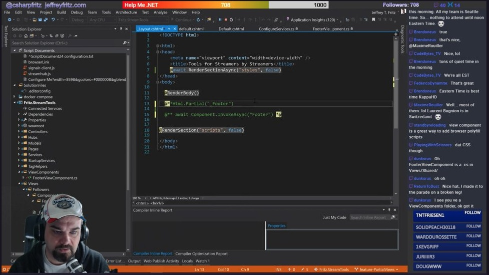

# Fritz.LiveStream

Jeff Fritz writes code live on video streams, and wants to give you a central place to ask questions, find samples, and links to projects and other materials referenced during the show.

## Watch LIVE

Jeff currently presents on [Twitch](https://twitch.tv/csharpfritz)

You can find his current schedule on the Twitch channel's page, and if you follow or subscribe to the channel you will be notified when the stream begins. 

## Get the Music!

Our friend Carl Franklin from [.NET Rocks](https://dotnetrocks.com) has graciously allowed us to play some of his [Music to Code By](http://mtcb.pwop.com)  during the stream.  Buy the [music](http://mtcb.pwop.com), or get a subscription with the mobile app at www.musictoflowby.com

## Watch recordings

Archive of all shows from the stream can be found on [Jeff's YouTube Fritz and Friends](https://www.youtube.com/playlist?list=PLVMqA0_8O85zHkvIMHgG74eskQTO5nfWy)  playlist.

## Ask Questions

If you want to know more about something or want to see a demo of something specific, you can ask Jeff by [opening an issue](https://github.com/csharpfritz/Fritz.LiveStream/issues/new) and adding the 'Question' label. 

The list of [currently outstanding questions](https://github.com/csharpfritz/Fritz.LiveStream/issues?q=is%3Aissue+is%3Aopen+label%3Aquestion+sort%3Acreated-asc) is available.  When questions are answered, they are closed and links are added to the wrap-up blog post for the stream they were answered in.

## Current Projects

Jeff has been working on the following projects on stream:

* [Fritz.StreamTools](https://github.com/csharpfritz/Fritz.StreamTools) - (Formerly called RunDown) An ASP.NET Core project that will manage show information for streamers and provide easy browser-based plugins for your video content.
* [CoreWiki](https://github.com/csharpfritz/CoreWiki) - An ASP.NET Core based content management system that has been built from scratch as a learner's project on stream.

## Former Projects

* [Fritz.ConfigurationBuilders](https://github.com/csharpfritz/Fritz.ConfigurationBuilders) - A collection of ConfigurationBuilders for .NET 4.7.1 and later that support loading application configuration from other sources include INI, YML, and RSS
* [Fritz.EpicBuildMusic](https://github.com/csharpfritz/Fritz.EpicBuildMusic) - A Visual Studio extension that is designed to make working in Visual Studio a little more fun.

## Guests

I enjoy having guests join me for some pair-programming, because we're always going to learn something new together.  More information
about my scheduled guests can how you can join me as a guest on the stream can be found on the [guests page](Guests.md).

## Jeff's Setup

Jeff has written about how he has the hardware configured as well as the software to produce stream [on his blog](http://jeffreyfritz.com/2017/12/live-streaming-101-my-setup/).  
*  Jeff uses [Posh-Git](https://github.com/dahlbyk/posh-git) to make the Powershell prompt easier to navigate while working with Git repositories 
*  When coding with a guest, Jeff and the guest use [Visual Studio Live Share](https://github.com/MicrosoftDocs/live-share/blob/master/README.md) to work on code on screen at the same time.
*  Jeff uses a bunch of great Visual Studio extensions, and you can find that list on the [WebTools repository](https://github.com/csharpfritz/Ignite2017-WebTools). 
