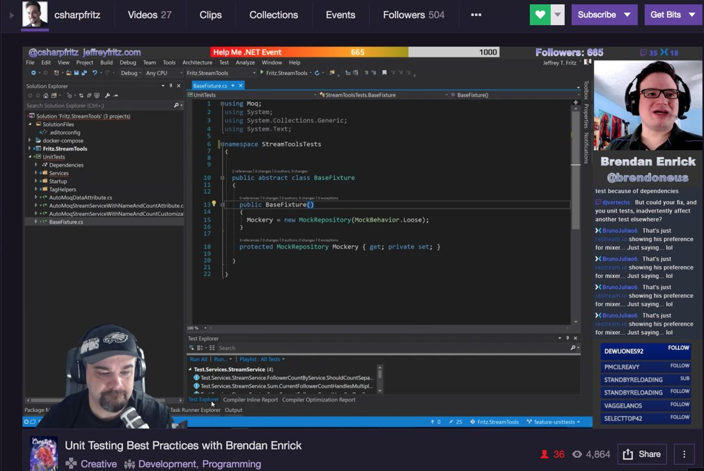

# The ASP.NET Core Workshop

In January 2018, the live stream hit a total of 500 followers, and met the initial follower goal Jeff set.  In return for meeting this goal, an ASP.NET Core 2.0 workshop was scheduled and would be hosted for approximately 8 hours on February 16, 2018 starting at 10am ET / 15:00 UTC. [Add it to your calendar](https://raw.githubusercontent.com/csharpfritz/Fritz.LiveStream/master/aspNetCoreWorkshop/Fritz_and_Friends_ASPNET_Core_Workshop.ics)

The project we built during the workshop is the [TripTracker project](https://github.com/csharpfritz/TripTracker) in my GitHub repository.

## Questions

*  __Is there a cost to attend the workshop?__
   *  Nope!  Completely free... tune in whenever you would like on [Twitch](twitch.tv/csharpfritz) or [Mixer](mixer.com/csharpfritz)

*  __Do I need to buy Jeff's book to follow along?__
   *  Nope!  No external materials are needed.  

*  __Can my colleagues tune in?  Is there a limit to the number of viewers?__
   *  Bring all of your friends!  It would be better if they each logged in to Twitch or Mixer individually, so that they can ask questions during the workshop

*  __What content are you covering?__
   *  We will build a complete application using ASP.NET Core for tracking travel information.

*  __Is this just Jeff presenting, or will there be guests during the workshop?__
   *  There will be guests!  I've recruited a handful of .NET experts to help during the day:
      * Shayne Boyer
      * Julie Lerman
      * Jon Galloway
      * _maybe one or two more_

* __I can't watch all day, will I be able to watch the VOD or recording on YouTube?__
   *  I'm not sure about this one yet... I'd like the content to be available, but it is going to be a LOT of video.

* __What should I have installed in order to follow along with the workshop?__
   *  You should install the .NET SDK from https://dot.net/core and it's not required, but we recommend a Visual Studio with .NET Core features enabled:
      *  [Visual Studio Code](https://code.visualstudio.com) - Free and open source for Mac, Linux, and Windows
      *  [Visual Studio 2017](https://visualstudio.com) - Community is free for hobbyists, students, and startups (with limitations).
      *  [Visual Studio for Mac](https://visualstudio.com) - Community is free for hobbyists, students, and startups (with limitations).
   *  At the end of the day we will be using [Docker](https://docker.com), so you should install those tools if you'd like to follow along.

* __Are the samples available online?__
   *  The sample code will all be available, and will be published on the day of the workshop 
   
## Tentative Schedule 

| Start Time | Topic | Guest |
| ----- | ---- | ----- |
| 10am ET | Get Started with dotnet new and our first API | Shayne Boyer |
| 11am ET | Using a database with Entity Framework Core | Julie Lerman |
| 12pm ET | QA break| - |
| 1pm ET | Razor Pages | Jon Galloway |
| 2pm ET | Authentication and Authorization | Jon Galloway |
| 3pm ET | QA break | - |
| 4pm ET | Reusable UI | - |
| 5pm ET | Deployment | Shayne Boyer |
